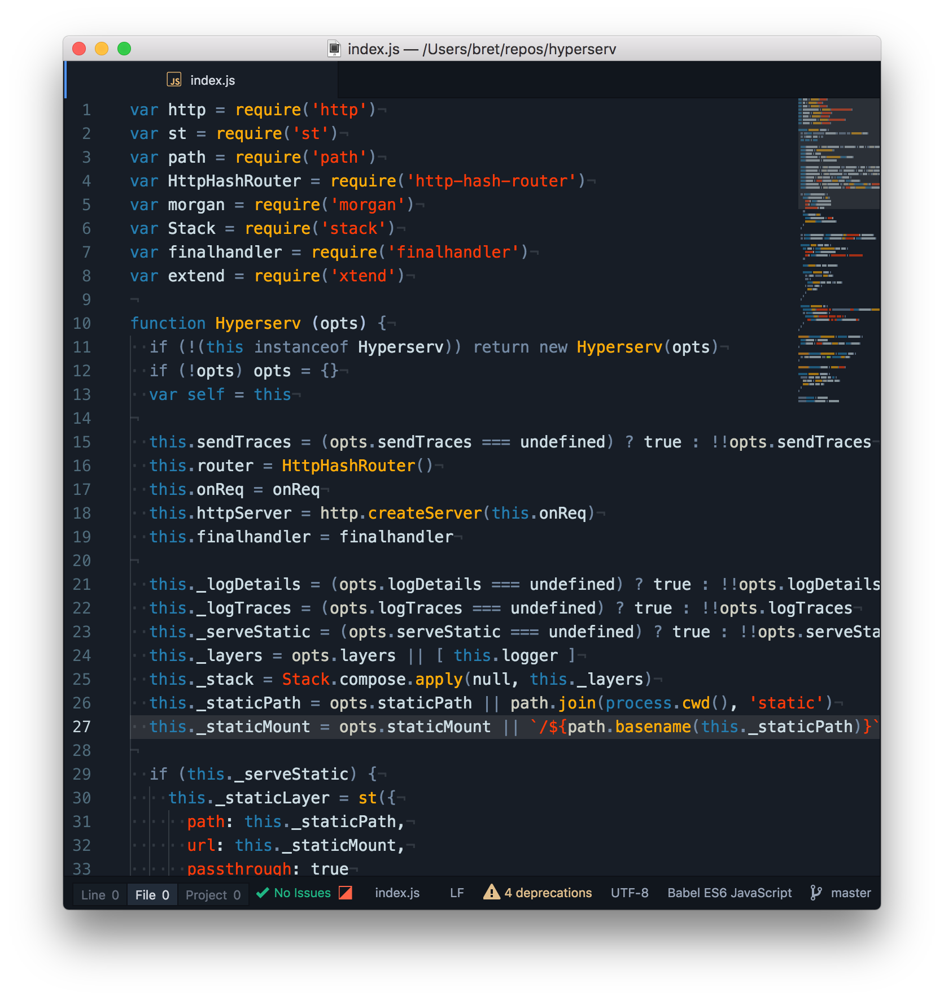
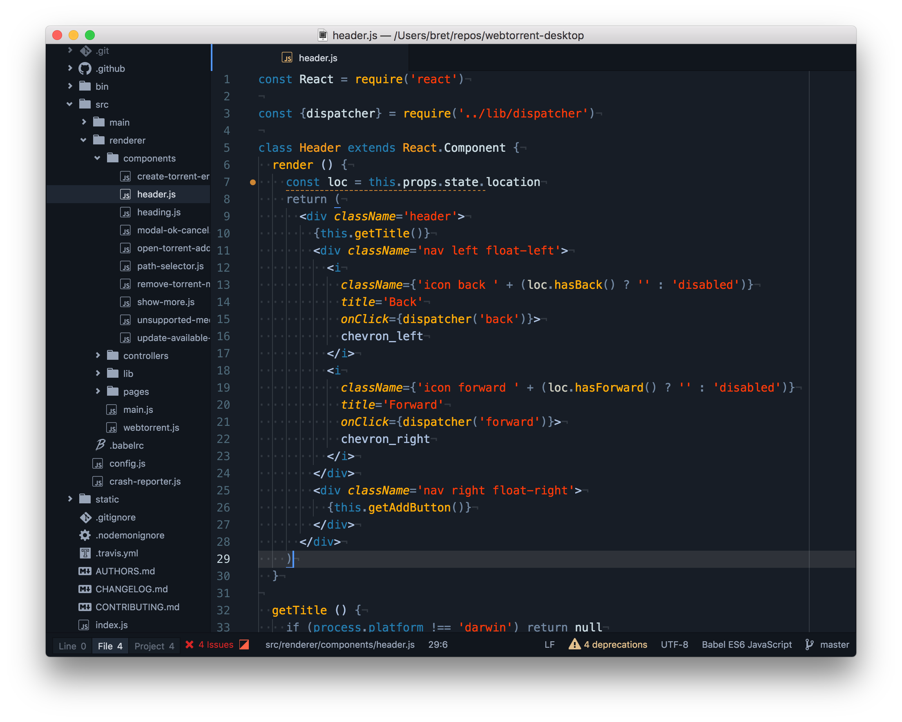
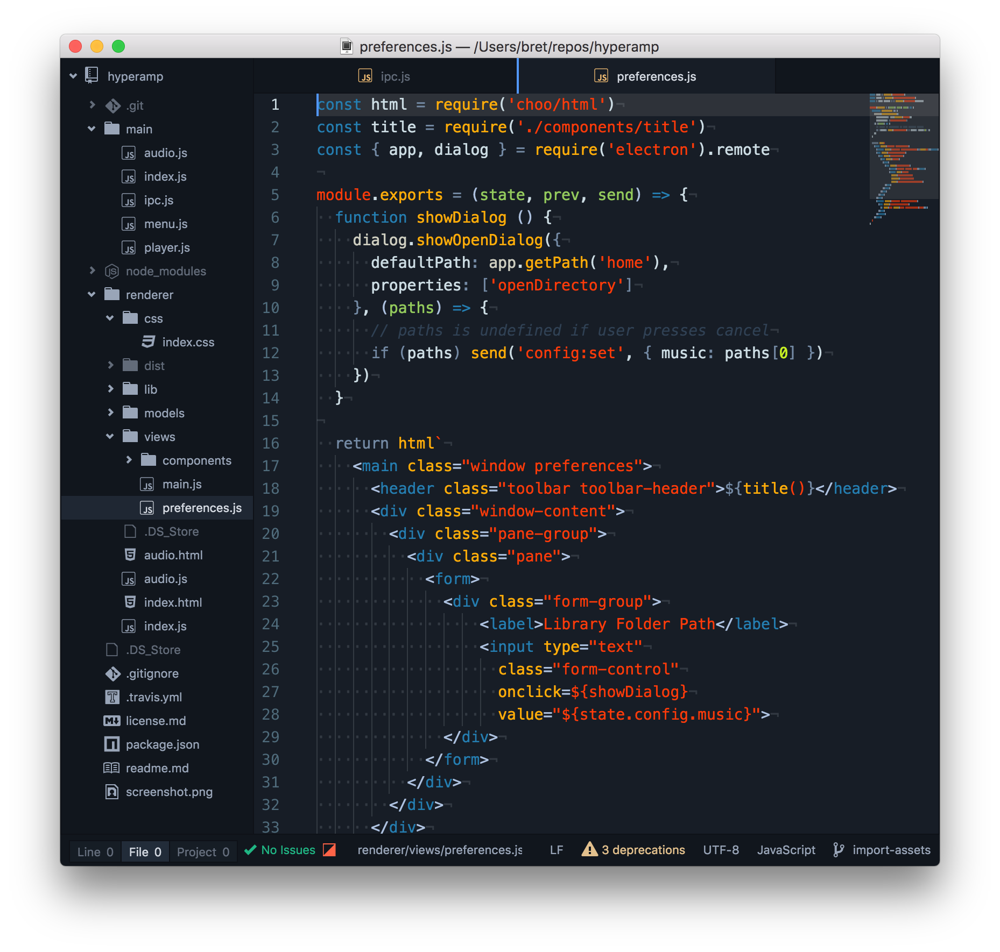

## Tron Legacy Syntax theme



> The UI theme is One Dark, which ships with atom and matches the color scheme.

### Install

```
$ apm install one-tron-legacy-syntax
```


This theme is a merge of [One Dark Syntax](https://github.com/atom/one-dark-syntax) with [Riari/tron-legacy-atom](https://github.com/Riari/tron-legacy-atom) which is an Atom editor adaptation of [daylerees's TronLegacy](https://github.com/daylerees/colour-schemes/blob/master/legacy/TronLegacy.tmTheme) syntax theme.


Riari did a great job of representing the spirit of Tron Legacy, but didn't track the project structure on One Dark.  The goal here is to port over Riari's work into a theme project structure based on One Dark, and fix some color inconsistencies I found with some language syntax highlights, specifically around the built in Javascript language definition.

Works with the standard Javascript language definition, as well as Babel Javascript.  Both have there advantages and disadvantages.  

### Gallery



